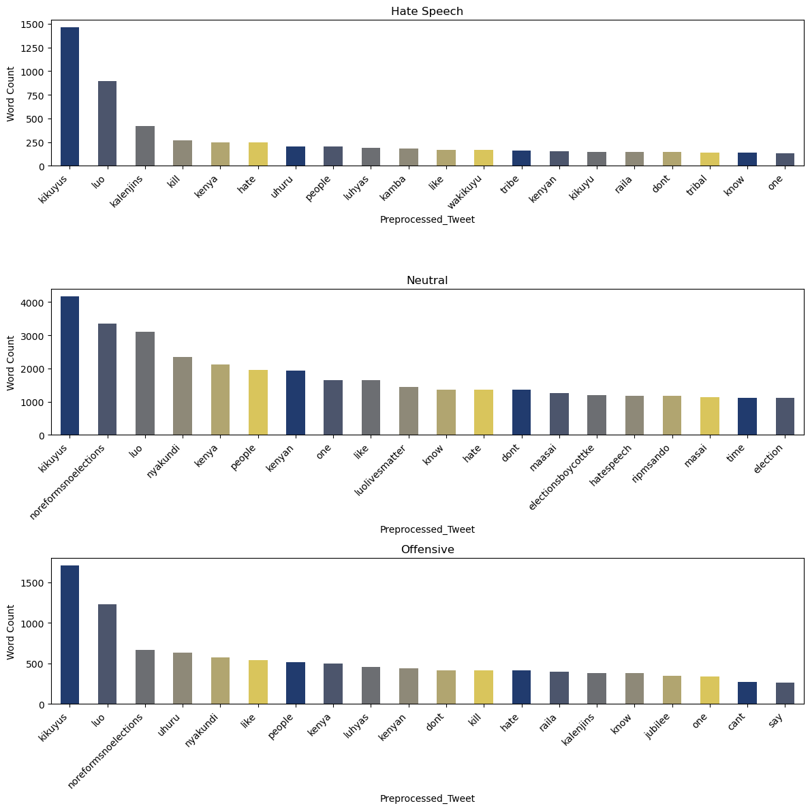
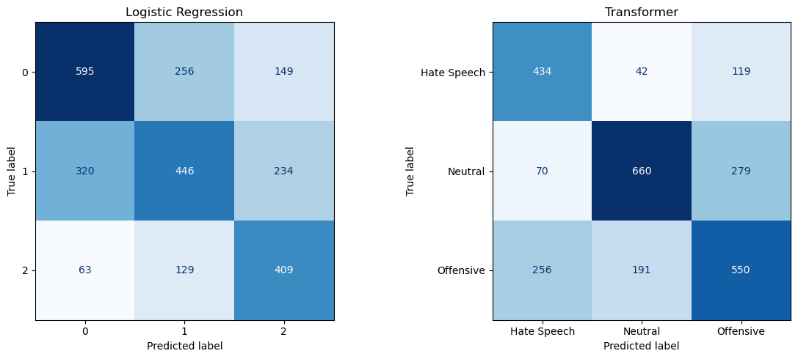
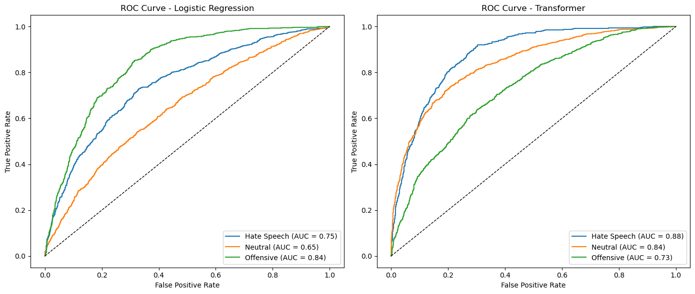

# Hate Speech and Offensive Language Detection in Kenyan Tweets

## Overview
This project focuses on building a machine learning solution to automatically detect and classify tweets from the Kenyan digital space into:
- **Hate Speech**
- **Offensive Content**
- **Neutral Content**

The model is designed to support early detection of harmful tweets during elections or politically charged events, aiding moderators, journalists, and civil society in promoting peace and constructive online discourse.

---

## Objectives
- Identify common terms/phrases used in inciting tweets.
- Build a **multi-class classification** model to label tweets as hate speech, offensive, or neutral.
- Compare traditional ML models (Logistic Regression, Naïve Bayes, Random Forest, XGBoost) with transformer-based deep learning models (RoBERTa).
- Evaluate model performance using **F1-score**, accuracy, and ROC-AUC.
- Deploy the best-performing model via **FastAPI** backend and **Streamlit** frontend.

---

## Dataset
**Source:** [Kaggle – HateSpeech_Kenya.csv]  
**Size:** ~48,000 tweets labeled for hate speech and offensive content.  

**Features:**
- `tweet` – Raw tweet text (primary input).
- `label` – Target variable:  
  - `0` → Neutral  
  - `1` → Offensive  
  - `2` → Hate Speech  

**Challenges in Data:**
- Presence of URLs, emojis, hashtags, and mentions.
- Code-switching between English, Swahili, and Kenyan slang.
- Class imbalance (more neutral tweets).

---

## Data Preprocessing
- Lowercasing text  
- Removing URLs, mentions, hashtags, emojis, punctuation  
- Tokenization + Lemmatization  
- Stopword removal (including Kenyan-specific filler words)  
- Feature representation with **TF-IDF** and **word embeddings**  
- Handling class imbalance via **undersampling**  

---

## Modeling
The following models were implemented and evaluated:
- Logistic Regression
- Naïve Bayes
- Random Forest
- XGBoost
- **RoBERTa Transformer Model** (fine-tuned for sequence classification)

---

## Model Evaluation
Metrics used:
- **F1-score** (primary)
- Accuracy
- ROC-AUC
- Confusion Matrix

The **RoBERTa** model achieved the best overall balance across precision, recall, and F1-score, making it the chosen model for deployment.

---
## Results
#### Word Distribution

 Words like kikuyus, luo, kalenjins, and kenya are dominant in all three categories, highlighting the focus on Kenyan ethnic groups and politics. Hate speech tweets prominently feature tribal identifiers and words associated with violence or negativity, such as kill and hate, indicating targeted hostility. Neutral tweets, in contrast, also center around ethnic groups but with additional election-related terms like morefromselections and election, suggesting a broader, less aggressive discourse. Offensive tweets show a mix of slurs, ethnic mentions, and aggression-related words, though with less concentration on elections compared to neutral tweets. Overall, these visualizations underline the central role of ethnicity and politics in shaping online discourse across all sentiments.

#### Confusion Matrix

The Transformer model shows better class-wise performance with higher true positives along the diagonal, indicating improved classification accuracy.

#### ROC-AUC Curve

- Overall, the Transformer shows stronger discrimination ability for Hate Speech and Neutral categories, indicating better overall classification performance in these classes.
- The Logistic Regression model seems to handle the Offensive class more effectively than the Transformer.

---

## Deployment Plan
The system is deployed with:
- **FastAPI** – Backend API for inference.
- **Streamlit** – User interface for interactive classification.
- Hosting options: Streamlit Cloud / Render / Hugging Face Spaces.

**User Flow:**
1. User enters tweet text into Streamlit app.
2. App sends request to FastAPI endpoint.
3. Model processes input and returns classification result.
4. Streamlit displays predicted category.

---
## Recommendations

- **Adopt the Transformer Model** – Given its superior performance across all metrics, the fine-tuned Transformer should be the primary model for deployment.
- **Ensemble Strategies** – Investigate combining the Transformer with top-performing traditional models (e.g., Logistic Regression) to leverage complementary strengths.
- **Periodic Retraining** – Regularly update the model with new data to adapt to evolving language patterns and slang in tweets.

